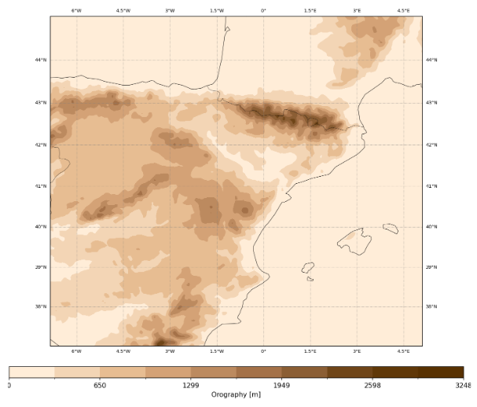
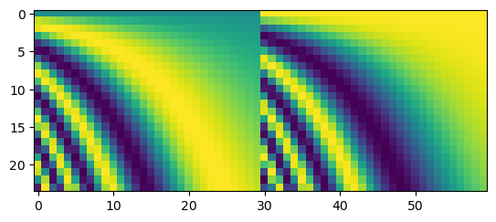

# DeepR: Deep Reanalysis.

Global reanalysis downscaling to regional scales by means of deep learning techniques.

## Introduction

In the rapidly evolving landscape of climate science and data analysis, the need for
high-resolution data has become increasingly evident. Climate researchers and
professionals in various fields, from agriculture to disaster management, rely
heavily on accurate and detailed data to make informed decisions. However, the existing
global reanalysis data, such as ERA5, with its coarse spatial resolution, often falls
short in meeting these requirements. In response to this pressing challenge, the DeepR
project, led by Antonio Pérez, Mario Santa Cruz, and Javier Diez, was conceived and
executed with the aim of downscaling ERA5 data to a finer resolution, thus enabling
enhanced accuracy and applicability across a wide range of industries and research
domains.

## Project Motivation

The ERA5 Global reanalysis data, with its spatial resolution of approximately 0.25
degrees, has proven to be a valuable resource for multiple sectors. Still, its
limitations in resolution can hinder precise decision-making and analysis across
diverse domains. The primary motivation behind the DeepR project was to bridge this gap
by downscaling ERA5 data to a finer resolution of
approximately 0.05 degrees, termed as CERRA resolution. This enhancement aimed to
unlock the full potential of climate data for improved decision support.

## Super-Resolution in Climate Science

The project drew inspiration from the field of image processing and computer vision,
specifically the concept of super-resolution. In image processing, super-resolution
involves augmenting the resolution or quality of an image, typically generating a
high-resolution image from one or more low-resolution iterations. DeepR adapted this
concept to climate science, making it a super-resolution task tailored to atmospheric
fields.

## Data: The Foundation of DeepR

In any data-intensive project, data plays a pivotal role, and DeepR is no exception.
The project relies on extensive datasets sourced from the publicly accessible Climate
Data Store (CDS), ensuring transparency and open access to valuable climate information.

The data used in this project has been generously provided by our mentors and is used
in its raw form without any processing. To download the data from the repository,
you can access the
[`european_weather_cloud.py`](scripts/download/european_weather_cloud.py) script.

Additionally, we have developed a script to directly download data from the Climate
Data Store. You can find this script at
[`climate_data_store.py`](scripts/download/climate_data_store.py).

The project focuses on a specific subdomain within the original domain. In our case,
this domain encompasses diverse ecosystems, including mountains, rivers, coastal areas,
and more. This simplification helps reduce the dimensionality of the problem while
maintaining the diversity necessary for comprehensive research.

The selected domain is shown here:



To achieve this spatial selection of the data, we utilize the
[`data_spatial_selection.py`](scripts/processing/data_spatial_selection.py) script,
which transforms the data into the desired domain.

The process of rewriting the data for the smaller domain aims to expedite data access,
enhancing both memory and time efficiency for smoother and faster data handling.
Furthermore, this approach empowers users to define their own specific domains and
seamlessly retrain the model according to their unique research requirements.

## Data Configuration

The data configuration section outlines how the project manages and processes the data.
This section is divided into three main parts: `features_configuration`,
`label_configuration`, and `split_coverages`.

### Features Configuration

This part focuses on the configuration of features used in the project.

```yaml
features_configuration:
  variables:
  - t2m
  data_name: era5
  spatial_resolution: "025deg"
  add_auxiliary:
    time: true
    lsm-low: true
    orog-low: true
    lsm-high: true
    orog-high: true
  spatial_coverage:
    longitude: [-8.35, 6.6]
    latitude: [46.45, 35.50]
  standardization:
    to_do: true
    cache_folder: /PATH/TO/.cache_reanalysis_scales
    method: domain-wise
  data_location: /PATH/TO/features/
  land_mask_location: /PATH/TO/static/land-mask_ERA5.nc
  orography_location: /PATH/TO/static/orography_ERA5.nc
```

- **Variables**: The variables to be included, such as `t2m` (2-meter temperature data).
- **Data Name**: The source of the feature data, which is `era5`.
- **Spatial Resolution**: The spatial resolution used for feature data is
  `0.25 degrees`.
- **Add Auxiliary Data**: Specifies whether auxiliary data is added. In this case,
  `time`, `lsm-low` (low-resolution land-sea mask), `orog-low` (low-resolution
  orography), `lsm-high` (high-resolution land-sea mask), and `orog-high`
  (high-resolution orography) are added.
- **Spatial Coverage**: The selected spatial coverage, defined by longitude and
  latitude ranges.
- **Standardization**: Indicates whether standardization is performed. The
  `to_do` flag is set to `true`, and the standardization method is `domain-wise`.
  Other possible methods include `pixel-wise` and `landmask-wise`.
- **Data Location**: The directory where feature data is stored.
- **Land Mask Location**: The location of the land-sea mask data for ERA5.
- **Orography Location**: The location of the orography data for ERA5.

### Label Configuration

This part focuses on the configuration of labels used in the project.

```yaml
label_configuration:
  variable: t2m
  data_name: cerra
  spatial_resolution: "005deg"
  spatial_coverage:
    longitude: [-6.85, 5.1]
    latitude: [44.95, 37]
  standardization:
    to_do: true
    cache_folder: /PATH/TO/.cache_reanalysis_scales
    method: domain-wise # pixel-wise, domain-wise, landmask-wise
  data_location: /PATH/TO/labels/
  land_mask_location: /PATH/TO/static/land-mask_CERRA.nc
  orography_location: /PATH/TO/static/orography_CERRA.nc
```

- **Variable**: The variable used as labels, which is `t2m` (2-meter temperature data).
- **Data Name**: The source of the label data, which is `cerra`.
- **Spatial Resolution**: The spatial resolution used for label data is `0.05 degrees`.
- **Spatial Coverage**: The selected spatial coverage, defined by longitude and
  latitude ranges.
- **Standardization**: Indicates whether standardization is performed. The
  `to_do` flag is set to `true`, and the standardization method is `domain-wise`.
  Other possible methods include `pixel-wise` and `landmask-wise`.
- **Data Location**: The directory where label data is stored.
- **Land Mask Location**: The location of the land-sea mask data for CERRA.
- **Orography Location**: The location of the orography data for CERRA.

### Split Coverages

Splitting the data into different time periods for training and validation.

```yaml
split_coverages:
  train:
    start: 1981-01
    end: 2013-12
    frequency: MS
  validation:
    start: 2014-01
    end: 2017-12
    frequency: MS
  test:
    start: 2018-01
    end: 2020-12
    frequency: MS
```

- **Train**: Data split for training begins from `1981-01` and ends at `2013-12`,
  with a frequency of `Monthly (MS)`.
- **Validation**: Data split for validation starts from `2014-01` and ends at
  `2017-12`, with a frequency of `Monthly (MS)`.
- **Test**: Data split for validation starts from `2018-01` and ends at
  `2020-12`, with a frequency of `Monthly (MS)`.

These configuration settings are crucial for organizing, processing, and standardizing
the data used in the project.

## Methodology

The main purpose of this library is to test the capabilities of deep diffusion models for reanalysis super-resolution tasks.

The objectives of this challenge focus on:

- Explore the capabilities of Deep Diffusion models to represent high resolution reanalysis datasets.

- Evaluate the impact of including several covariables in the model.

  - Conditioning on time stamps
  - Conditioning on meteorological covariables
  - Conditioning on in-site observations

### Super Resolution Diffusion model

Explanation of Diffusion processes...

Here, DL is considered to model the $\\epsilon_t$ sampled at each step given $x\_{t+1}$ and conditioned on the LR image.

#### Training

During training, for each batch of data, we sample random timesteps $t$ and noise $\\epsilon\_{t}$ and derive the corresponding values $x_t$. Then, we train our DL model to minimize the following loss function:

$$ \\mathcal{L} (x) = || \\epsilon\_{t} - \\Phi \\left(x\_{t+1}, t \\right) ||^2$$

which is the mean squared error (MSE) between:

- the noise, $\\epsilon\_{t}$, added at timestep $t$

- the prediction of the DL model, $\\Phi$, taking as input the timestep $t$ and the noisy matrix $x\_{t+1}$.

#### Inference

During inference, we can sample random noise and run the reverse process conditioned on input ERA5 grids, to obtain high resolution reanalysis grids. Another major benefit from this approach is the possibility of generation an ensemble of grids to represent its uncertainty avoiding the mode collapse (common in GANs).

### $\\epsilon\_{t}$-model

The library [diffusers](https://huggingface.co/docs/diffusers/v0.16.0/en/api/models) brings several options to include in Diffusion Models. Here, we present several of the options included there that may fit our use case as well as our own tailored implementations.

#### diffusers.UNet2DModel

The [diffusers.UNet2DModel](https://huggingface.co/docs/diffusers/v0.16.0/en/api/models#diffusers.UNet2DModel) is the most similar class to our implementation, which is a U-net architecture with several options for down and up blocks.

- **Down blocks**: DownBlock2D, ResnetDownsampleBlock2D, AttnDownBlock2D, CrossAttnDownBlock2D, SimpleCrossAttnDownBlock2D, SkipDownBlock2D, AttnSkipDownBlock2D, DownEncoderBlock2D, AttnDownEncoderBlock2D, KDownBlock2D and KCrossAttnDownBlock2D.

- **Up block**: UpBlock2D, ResnetUpsampleBlock2D, CrossAttnUpBlock2D, SimpleCrossAttnUpBlock2D, AttnUpBlock2D, SkipUpBlock2D, AttnSkipUpBlock2D, UpDecoderBlock2D, AttnUpDecoderBlock2D, KUpBlock2D and KCrossAttnUpBlock2D.

One example configuration to use [diffusers.UNet2DModel](https://huggingface.co/docs/diffusers/v0.16.0/en/api/models#diffusers.UNet2DModel) is included below:

```
training_configuration:
  ...
  model_configuration:
    eps_model:
      class_name: diffusers.UNet2DModel
      kwargs:
        block_out_channels: [32, 64, 128]
        down_block_types: [DownBlock2D, AttnDownBlock2D, AttnDownBlock2D]
        up_block_types: [AttnUpBlock2D, AttnUpBlock2D, UpBlock2D]
        layers_per_block: 2
        time_embedding_type: positional
        in_channels: 2
        out_channels: 1
        sample_size: [20, 32]
  ...
```

The [diffusers.UNet2DModel](https://huggingface.co/docs/diffusers/v0.16.0/en/api/models#diffusers.UNet2DModel) also accepts conditioning on labels through its argument `class_labels`. First, the embedding type must be specified in the [`__init__`](https://github.com/huggingface/diffusers/blob/v0.16.0/src/diffusers/models/unet_2d.py#L83) method trough:

- Passing `class_embed_type` (Options are 'timestep', 'identity' or None).
- Passing `num_class_embeds` with the size of the dictionary of embeddings to use.

For example, to consider the hour of the data as covariate in this model we have two options:

**Option A:** Set `num_class_embeds = 24` in the model creation and `hour_embed_type = class` in training configuration. This way the model learns a Embedding table for each hour.

**Option B:** Set `class_embed_type = identity` in the model configuration and `hour_embed_type = positional` in training configuration.

**Option C:** Set `class_embed_type = timestep` in the model configuration and `hour_embed_type` = `timestep` in training configuration. This configuration applies the same cos & sin transformation as in Option B maintaining the same `max_duration=10000`. Unlike Option B, we fit 2 `nn.Linear` after the embedding before feeding it to the NN.

#### diffusers.UNet2DConditionModel

The[diffusers.UNet2DConditionModel](https://huggingface.co/docs/diffusers/v0.16.0/en/api/models#diffusers.UNet2DConditionModel) is an extension of the previous [diffusers.UNet2DModel](https://huggingface.co/docs/diffusers/v0.16.0/en/api/models#diffusers.UNet2DModel) to consider conditions during the reverse process such as time stamps, or other covariables.

One interesting parameter to tune is the activation funcion used in the time embedding which can be: Swish, Mish, SiLU or GELU.

But the most remarkable difference is the possibility of conditioning the reverse diffusion process in the encoder hidden states (comming from images, text, or any other)

One example configuration to use [diffusers.UNet2DConditionModel](https://huggingface.co/docs/diffusers/v0.16.0/en/api/models#diffusers.UNet2DConditionModel) is included below:

```
training_configuration:
  ...
  model_configuration:
    eps_model:
      class_name: diffusers.UNet2DConditionModel
      kwargs:
        block_out_channels: [124, 256, 512]
        down_block_types: [CrossAttnDownBlock2D, CrossAttnDownBlock2D, DownBlock2D]
        mid_block_type: UNetMidBlock2DCrossAttn
        up_block_types: [UpBlock2D, CrossAttnUpBlock2D, CrossAttnUpBlock2D]
        layers_per_block: 2
        time_embedding_type: positional
        in_channels: 2
        out_channels: 1
        sample_size: [20, 32]
        only_cross_attention: False
        cross_attention_dim: 256
        addition_embed_type: other
  ...
```

#### Tailored UNet

In particular, a tailored U-Net architecture with 2D convolutions, residual connections and attetion layers is used.


The parameteres of these model implemented in [deepr/model/unet.py](deepr/model/unet.py) are:

- `image_channels`: It is the number of channels of the high resolution imagen we want to generate, that matches with the number of channels of the output from the U-Net. Default value is `1`, as we plan to sample one variable at a time.

- `n_channels`: It is the number of output channels of the initial Convolution. Defaults to `16`.

- `channel_multipliers`: It is the multiplying factor over the channels applied at each down/upsampling level of the U-Net. Defaults to `[1, 2, 2, 4]`.

- `is_attention`: It represents the use of Attention over each down/upsampling level of the U-Net. Defaults to `[False, False, True, True]`.

- `n_blocks`: The number of residual blocks considered in each level. Defaults to `2`.

- `conditioned_on_input`: The number of channels of the conditions considered.

*NOTE I*: The length of `channel_multipliers` and `is_attention` should match as it sets the number of resolutions of our U-Net architecture.

*NOTE II*: Spatial tensors fed to Diffusion model must have shapes of length multiple of $2^{\\text{num resolutions} - 1}$.

An example configuration for this model is specified in training_configuration > model_configuration > eps_model,

```
training_configuration:
  ...
  model_configuration:
    eps_model:
      class_name: UNet
      kwargs:
        block_out_channels: [32, 64, 128, 256]
        is_attention: [False, False, True, True]
        layers_per_block: 2
        time_embedding_type: positional
        in_channels: 2
        out_channels: 1
        sample_size: [20, 32]
  ...
```

##### Downsampling

The class [Downsample](deepr/model/unet_blocks.py#LL20) ...

##### Upsampling

The class [Upsample](deepr/model/unet_blocks.py#LL8) ...

##### Down Block

The class [Down block](deepr/model/unet_blocks.py#LL30)

##### Middle Block

The class [Middle block](deepr/model/unet_blocks.py#LL123)

##### Up Block

The class [Up block](deepr/model/unet_blocks.py#LL73)

##### Residual Block

##### Final Block

## Project Outputs

Models trained on Mediterranean area with t2m data from ERA5 and CERRA.

- [Baseline Neural Network](https://huggingface.co/predictia/europe_reanalysis_downscaler_convbaseline): An Up Convolutional Neural Network (CNN) to predict the residuals of a deterministic interpolation method as bilinear, bicubic, nearest...
- [Conv2D + Swin2SR](https://huggingface.co/predictia/europe_reanalysis_downscaler_convswin2sr): A combination of CNN and a Swin2SR transformers to predict the residuals of a deterministic interpolation method as bilinear, bicubic, nearest...
- [CERRA VQ-VAE 2](https://huggingface.co/predictia/cerra_tas_vqvae): A Vector Quantized Variational AutoEncoder (VQ-VAE) 2 to be used for latent diffusion models (LDM) and reduce the dimensionality of diffusion processes.
- [Denoising Diffusion Probabilistic Model](https://huggingface.co/predictia/europe_reanalysis_downscaler_diffuser): A diffusion model to denoise the ERA5 image using any of the previous methods to guide the generation process.

### Models (HuggingFace)

- [**Swin2SR (x4)**](https://huggingface.co/predictia/europe_reanalysis_downscaler_swin2sr): A novel transformed-based method for image super-resolution trained with meteorological datasets.

- [**Conditioned Denoising Diffusion Probabilistic Model**](predictia/europe_reanalysis_downscaler_diffuser): A tailored DDPM that accepts temporal covariates as the hours of the day or the day of the years as input to the $\\epsilon$-model.

## Appendix I: Positional Embeddings

When working with sequential data, the order of the elements is important, and we must pay attention to how we pass this information to our models.

In our particular case, the timesteps $t$ is encoded with positional embeddings as proposed in the [Denoising Diffusion Probabilistic Models](https://arxiv.org/pdf/2006.11239.pdf) paper.



Besides, we may encoded other important features as the hour of the day or the day of the year, which are cyclical. This is different from positional encodings because we want the encoding from hour 23 to be more similar to the one from 0 than from hour 18.

## References

- Ho, J., Jain, A., & Abbeel, P. (2020). [Denoising diffusion probabilistic models](https://arxiv.org/pdf/2006.11239.pdf). Advances in Neural Information Processing Systems, 33, 6840-6851.

- Song, J., Meng, C., & Ermon, S. (2020). [Denoising diffusion implicit models](https://arxiv.org/pdf/2010.02502.pdf). arXiv preprint arXiv:2010.02502.

- Conde, M. V., Choi, U. J., Burchi, M., & Timofte, R. (2022). [Swin2SR: Swinv2 transformer for compressed image super-resolution and restoration](https://arxiv.org/pdf/2209.11345.pdf). arXiv preprint arXiv:2209.11345.

- Rombach, R., Blattmann, A., Lorenz, D., Esser, P., & Ommer, B. (2022). [High-resolution image synthesis with latent diffusion models](https://arxiv.org/pdf/2112.10752.pdf). In Proceedings of the IEEE/CVF Conference on Computer Vision and Pattern Recognition (pp. 10684-10695).

- [Annotated Deep Learning Paper implementations](https://github.com/labmlai/annotated_deep_learning_paper_implementations)

## License

```
Copyright 2023, European Union.

Licensed under the Apache License, Version 2.0 (the "License");
you may not use this file except in compliance with the License.
You may obtain a copy of the License at

    http://www.apache.org/licenses/LICENSE-2.0

Unless required by applicable law or agreed to in writing, software
distributed under the License is distributed on an "AS IS" BASIS,
WITHOUT WARRANTIES OR CONDITIONS OF ANY KIND, either express or implied.
See the License for the specific language governing permissions and
limitations under the License.
```

## Workflow for developers/contributors

For best experience create a new conda environment (e.g. DEVELOP) with Python 3.10:

```
conda create -n deepr-cuda -c conda-forge python=3.10
conda activate deepr-cuda
```

A data directory for the testing data must be created:

```
cd tests
mkdir data
cd data
mkdir features
mkdir labels
```

Once the directories have been created, testing data can be downloaded:

```
cd tests
wget -O data.zip https://cloud.predictia.es/s/zen8PGwJbi7mTCB/download
unzip data.zip
rm data.zip
```

Before pushing to GitHub, run the following commands:

1. Update conda environment: `make conda-env-update`
1. Install this package: `pip install -e .`
1. Sync with the latest [template](https://github.com/ecmwf-projects/cookiecutter-conda-package) (optional): `make template-update`
1. Run quality assurance checks: `make qa`
1. Run tests: `make unit-tests`
1. Run the static type checker: `make type-check`
1. Build the documentation (see [Sphinx tutorial](https://www.sphinx-doc.org/en/master/tutorial/)): `make docs-build`
