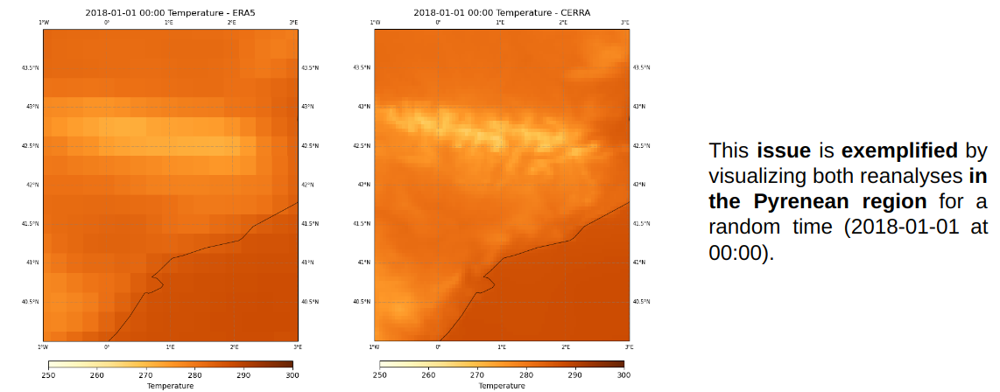
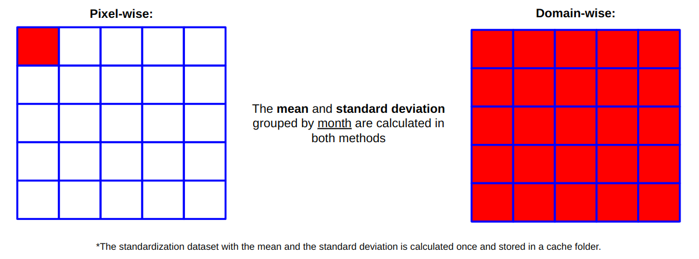
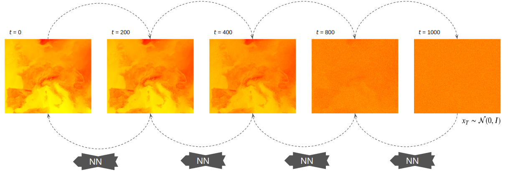
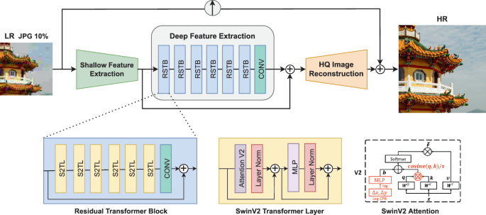

# DeepR: Deep Reanalysis.

Global reanalysis downscaling to regional scales by means of deep learning techniques.

## Introduction

In the rapidly evolving landscape of climate science and data analysis, the need for
high-resolution data has become increasingly evident. Climate researchers and
professionals in various fields, from agriculture to disaster management, rely
heavily on accurate and detailed data to make informed decisions. However, the existing
global reanalysis data, such as ERA5, with its coarse spatial resolution, often falls
short in meeting these requirements. In response to this pressing challenge, the DeepR
project, led by Antonio Pérez, Mario Santa Cruz, and Javier Diez, was conceived and
executed with the aim of downscaling ERA5 data to a finer resolution, thus enabling
enhanced accuracy and applicability across a wide range of industries and research
domains.

______________________________________________________________________

## Project Motivation

The ERA5 Global reanalysis data, with its spatial resolution of approximately 0.25
degrees, has proven to be a valuable resource for multiple sectors. Still, its
limitations in resolution can hinder precise decision-making and analysis across
diverse domains. The primary motivation behind the DeepR project was to bridge this gap
by downscaling ERA5 data to a finer resolution of
approximately 0.05 degrees, termed as CERRA resolution. This enhancement aimed to
unlock the full potential of climate data for improved decision support.



______________________________________________________________________

## Super-Resolution in Climate Science

The project drew inspiration from the field of image processing and computer vision,
specifically the concept of super-resolution. In image processing, super-resolution
involves augmenting the resolution or quality of an image, typically generating a
high-resolution image from one or more low-resolution iterations. DeepR adapted this
concept to climate science, making it a super-resolution task tailored to atmospheric
fields.

______________________________________________________________________

## Data: The Foundation of DeepR

In any data-intensive project, data plays a pivotal role, and DeepR is no exception.
The project relies on extensive datasets sourced from the publicly accessible Climate
Data Store (CDS), ensuring transparency and open access to valuable climate information.

The data used in this project has been generously provided by our mentors and is used
in its raw form without any processing. To download the data from the repository,
you can access the
[`european_weather_cloud.py`](scripts/download/european_weather_cloud.py) script.

Additionally, we have developed a script to directly download data from the Climate
Data Store. You can find this script at
[`climate_data_store.py`](scripts/download/climate_data_store.py).

### Focus on a specific domain

The project focuses on a specific subdomain within the original domain. In our case,
this domain encompasses diverse ecosystems, including mountains, rivers, coastal areas,
and more. This simplification helps reduce the dimensionality of the problem while
maintaining the diversity necessary for comprehensive research.

The selected domain is shown here:


To achieve this spatial selection of the data, we utilize the
[`data_spatial_selection.py`](scripts/processing/data_spatial_selection.py) script,
which transforms the data into the desired domain.

The process of rewriting the data for the smaller domain aims to expedite data access,
enhancing both memory and time efficiency for smoother and faster data handling.
Furthermore, this approach empowers users to define their own specific domains and
seamlessly retrain the model according to their unique research requirements.

______________________________________________________________________

## Definition in configuration file

The data configuration section outlines how the project manages and processes the data.
This section is divided into three main parts: `features_configuration`,
`label_configuration`, and `split_coverages`.

### Features Configuration

This part focuses on the configuration of features used in the project.

```yaml
features_configuration:
  variables:
  - t2m
  data_name: era5
  spatial_resolution: "025deg"
  add_auxiliary:
    time: true
    lsm-low: true
    orog-low: true
    lsm-high: true
    orog-high: true
  spatial_coverage:
    longitude: [-8.35, 6.6]
    latitude: [46.45, 35.50]
  standardization:
    to_do: true
    cache_folder: /PATH/TO/.cache_reanalysis_scales
    method: domain-wise
  data_location: /PATH/TO/features/
  land_mask_location: /PATH/TO/static/land-mask_ERA5.nc
  orography_location: /PATH/TO/static/orography_ERA5.nc
```

- **Variables**: The variables to be included, such as `t2m` (2-meter temperature data).
- **Data Name**: The source of the feature data, which is `era5`.
- **Spatial Resolution**: The spatial resolution used for feature data is
  `0.25 degrees`.
- **Add Auxiliary Data**: Specifies whether auxiliary data is added. In this case,
  `time`, `lsm-low` (low-resolution land-sea mask), `orog-low` (low-resolution
  orography), `lsm-high` (high-resolution land-sea mask), and `orog-high`
  (high-resolution orography) are added.
- **Spatial Coverage**: The selected spatial coverage, defined by longitude and
  latitude ranges.
- **Standardization**: Indicates whether standardization is performed. The
  `to_do` flag is set to `true`, and the standardization method is `domain-wise`.
  Other possible methods include `pixel-wise` and `landmask-wise`.
- **Data Location**: The directory where feature data is stored.
- **Land Mask Location**: The location of the land-sea mask data for ERA5.
- **Orography Location**: The location of the orography data for ERA5.

______________________________________________________________________

### Label Configuration

This part focuses on the configuration of labels used in the project.

```yaml
label_configuration:
  variable: t2m
  data_name: cerra
  spatial_resolution: "005deg"
  spatial_coverage:
    longitude: [-6.85, 5.1]
    latitude: [44.95, 37]
  standardization:
    to_do: true
    cache_folder: /PATH/TO/.cache_reanalysis_scales
    method: domain-wise # pixel-wise, domain-wise, landmask-wise
  data_location: /PATH/TO/labels/
  land_mask_location: /PATH/TO/static/land-mask_CERRA.nc
  orography_location: /PATH/TO/static/orography_CERRA.nc
```

- **Variable**: The variable used as labels, which is `t2m` (2-meter temperature data).
- **Data Name**: The source of the label data, which is `cerra`.
- **Spatial Resolution**: The spatial resolution used for label data is `0.05 degrees`.
- **Spatial Coverage**: The selected spatial coverage, defined by longitude and
  latitude ranges.
- **Standardization**: Indicates whether standardization is performed. The
  `to_do` flag is set to `true`, and the standardization method is `domain-wise`.
  Other possible methods include `pixel-wise` and `landmask-wise`.
- **Data Location**: The directory where label data is stored.
- **Land Mask Location**: The location of the land-sea mask data for CERRA.
- **Orography Location**: The location of the orography data for CERRA.

______________________________________________________________________

### Split Coverages

Splitting the data into different time periods for training, validation and test.

```yaml
split_coverages:
  train:
    start: 1981-01
    end: 2013-12
    frequency: MS
  validation:
    start: 2014-01
    end: 2017-12
    frequency: MS
  test:
    start: 2018-01
    end: 2020-12
    frequency: MS
```

- **Train**: Data split for training begins from `1981-01` and ends at `2013-12`,
  with a frequency of `Monthly (MS)`.
- **Validation**: Data split for validation starts from `2014-01` and ends at
  `2017-12`, with a frequency of `Monthly (MS)`.
- **Test**: Data split for validation starts from `2018-01` and ends at
  `2020-12`, with a frequency of `Monthly (MS)`.

These configuration settings are crucial for organizing, processing, and standardizing
the data used in the project.

______________________________________________________________________

## Methodology

### Standardization

#### Why is it important?

In the context of deep learning for climatology, standardizing climatological data is a
crucial step. Standardization refers to the process of transforming the data to have a
mean of zero and a standard deviation of one. This process is vital for several reasons:

- **Preventing Dominance**: Standardization prevents one variable from dominating the
  learning process. In climate data, variables can have vastly different scales and
  magnitudes. Without standardization, variables with larger scales could overshadow
  others, leading to biased model training.

- **Capturing Complex Patterns**: Standardized data allows the deep learning model to
  effectively capture complex climate patterns across diverse geographical regions.
  By removing scale differences, the model can focus on extracting meaningful patterns
  and relationships within the data.

- **Facilitating Convergence**: Deep neural networks benefit from standardized input
  data. It helps in the convergence of the network during training. When the input
  data has consistent scales and distributions, the optimization process becomes more
  stable, and the model is more likely to converge to a meaningful solution.

#### Application

To apply standardization to climatological data, we use the script located in
[`scaler.py`](%60deepr/data/scaler.py%60). This script automates the process of
standardization, making it easy to preprocess large datasets efficiently.



In summary, standardizing climatological data is a fundamental preprocessing step
that ensures the deep learning model can learn effectively, prevent variable dominance,
capture intricate climate patterns, and converge efficiently during training. It plays
a pivotal role in enhancing the model's performance and its ability to provide
valuable insights into climatic phenomena.

______________________________________________________________________

## Modeling

The two main modeling approaches covered are:

### Diffusion model

The probabilistic generative model employed in this context is a sophisticated
framework designed to denoise images. It leverages a diffusion process, which is a
mathematical concept representing the gradual spread of information or change across
data. In the context of image denoising, the diffusion process helps in gradually
removing noise from an image while preserving the underlying structure and content.

Advantages of the Model:

- Learning Capacity: The probabilistic generative model is endowed with significant
  learning capacity. It has the ability to learn intricate structures and patterns
  from data. This means it can effectively capture complex features, textures, and
  nuances present in images. By learning from a diverse range of images, it becomes
  proficient in identifying and preserving the underlying information even in noisy
  or low-resolution inputs.

- Extrapolation: The model exhibits a remarkable generalization capability known as
  extrapolation. It means that once the model has learned from a set of training data,
  it can extend its knowledge to new and unseen scenarios. This ability is invaluable
  in real-world applications where the model encounters image inputs it hasn't
  explicitly seen during training. Despite this, it can produce high-quality denoised
  outputs.

- Realism: A key strength of the probabilistic generative model is its capacity to
  produce denoised images that maintain a high level of realism. This realism extends
  to preserving fine details, textures, and nuances in the upscaled images.
  Additionally, the model is adept at handling artifacts that may be present in the
  input images, resulting in outputs that closely resemble natural, artifact-free images.

The scheme of the Diffusion process:



## The diffusers library

The [Diffusers](https://huggingface.co/docs/diffusers/v0.16.0/en/api/models) library
provides a comprehensive set of options for working with Diffusion Models.
In this documentation, we explore various options and functionalities available in the
library that can be tailored to specific use cases or extended with custom
implementations.

______________________________________________________________________

### diffusers.UNet2DModel

The [diffusers.UNet2DModel](https://huggingface.co/docs/diffusers/v0.16.0/en/api/models#diffusers.UNet2DModel)
class closely resembles our U-net architecture. It offers flexibility in designing the
down and up blocks, making it a versatile choice for various tasks.

#### Down Blocks

You can choose from a variety of down block types, including:

- DownBlock2D
- ResnetDownsampleBlock2D
- AttnDownBlock2D
- CrossAttnDownBlock2D
- SimpleCrossAttnDownBlock2D
- SkipDownBlock2D
- AttnSkipDownBlock2D
- DownEncoderBlock2D
- AttnDownEncoderBlock2D
- KDownBlock2D
- KCrossAttnDownBlock2D

#### Up Blocks

The available up block types include:

- UpBlock2D
- ResnetUpsampleBlock2D
- CrossAttnUpBlock2D
- SimpleCrossAttnUpBlock2D
- AttnUpBlock2D
- SkipUpBlock2D
- AttnSkipUpBlock2D
- UpDecoderBlock2D
- AttnUpDecoderBlock2D
- KUpBlock2D
- KCrossAttnUpBlock2D

Here's an example configuration for
[diffusers.UNet2DModel](https://huggingface.co/docs/diffusers/v0.16.0/en/api/models#diffusers.UNet2DModel):

```yaml
training_configuration:
  type: diffusion
  model_configuration:
    eps_model:
      class_name: diffusers.UNet2DModel
      kwargs:
        block_out_channels: [112, 224, 336, 448]
        down_block_types: [DownBlock2D, AttnDownBlock2D, AttnDownBlock2D, AttnDownBlock2D]
        up_block_types: [AttnUpBlock2D, AttnUpBlock2D, AttnUpBlock2D, UpBlock2D]
        layers_per_block: 2
        time_embedding_type: positional
        num_class_embeds: 24
        in_channels: 2
        norm_num_groups: 4
    scheduler:
      class_name: LMSDiscreteScheduler
      kwargs:
        num_train_timesteps: 1000
        beta_start: 0.0001
        beta_end: 0.02
        beta_schedule: linear
        prediction_type: epsilon
        timestep_spacing: trailing
```

The [diffusers.UNet2DModel](https://huggingface.co/docs/diffusers/v0.16.0/en/api/models#diffusers.UNet2DModel)
also accepts conditioning on labels through its argument `class_labels`. First,
the embedding type must be specified in the [`__init__`](https://github.com/huggingface/diffusers/blob/v0.16.0/src/diffusers/models/unet_2d.py#L83) method trough:

- Passing `class_embed_type` (Options are 'timestep', 'identity' or None).
- Passing `num_class_embeds` with the size of the dictionary of embeddings to use.

For example, to consider the hour of the data as covariate in this model we have
two options:

**Option A:** Set `num_class_embeds = 24` in the model creation and
`hour_embed_type = class` in training configuration. This way the model learns
an Embedding table for each hour.

**Option B:** Set `class_embed_type = identity` in the model configuration and
`hour_embed_type = positional` in training configuration.

**Option C:** Set `class_embed_type = timestep` in the model configuration and
`hour_embed_type` = `timestep` in training configuration. This configuration applies
the same cos & sin transformation as in Option B maintaining the same
`max_duration=10000`. Unlike Option B, we fit 2 `nn.Linear` after the embedding
before feeding it to the NN.

______________________________________________________________________

### diffusers.UNet2DConditionModel

The [diffusers.UNet2DConditionModel](https://huggingface.co/docs/diffusers/v0.16.0/en/api/models#diffusers.UNet2DConditionModel) is an extension of the previous [diffusers.UNet2DModel](https://huggingface.co/docs/diffusers/v0.16.0/en/api/models#diffusers.UNet2DModel) to consider conditions during the reverse process such as time stamps, or other covariables.

One interesting parameter to tune is the activation funcion used in the time embedding which can be: Swish, Mish, SiLU or GELU.

But the most remarkable difference is the possibility of conditioning the reverse diffusion process in the encoder hidden states (comming from images, text, or any other)

One example configuration to use [diffusers.UNet2DConditionModel](https://huggingface.co/docs/diffusers/v0.16.0/en/api/models#diffusers.UNet2DConditionModel) is included below:

```yaml
training_configuration:
  type: diffusion
  model_configuration:
    eps_model:
      class_name: diffusers.UNet2DConditionModel
      kwargs:
        block_out_channels: [
          124,
          256,
          512
        ]
        down_block_types: [
          CrossAttnDownBlock2D,
          CrossAttnDownBlock2D,
          DownBlock2D
        ]
        mid_block_type: UNetMidBlock2DCrossAttn
        up_block_types: [
          UpBlock2D,
          CrossAttnUpBlock2D,
          CrossAttnUpBlock2D
        ]
        layers_per_block: 2
        time_embedding_type: positional
        in_channels: 2
        out_channels: 1
        sample_size: [20, 32]
        only_cross_attention: False
        cross_attention_dim: 256
        addition_embed_type: other
```

______________________________________________________________________

### Tailored UNet

In particular, a tailored U-Net architecture with 2D convolutions, residual connections and attetion layers is used.


The parameteres of these model implemented in [deepr/model/unet.py](deepr/model/unet.py) are:

- `image_channels`: It is the number of channels of the high resolution imagen we want to generate, that matches with the number of channels of the output from the U-Net. Default value is `1`, as we plan to sample one variable at a time.

- `n_channels`: It is the number of output channels of the initial Convolution. Defaults to `16`.

- `channel_multipliers`: It is the multiplying factor over the channels applied at each down/upsampling level of the U-Net. Defaults to `[1, 2, 2, 4]`.

- `is_attention`: It represents the use of Attention over each down/upsampling level of the U-Net. Defaults to `[False, False, True, True]`.

- `n_blocks`: The number of residual blocks considered in each level. Defaults to `2`.

- `conditioned_on_input`: The number of channels of the conditions considered.

*NOTE I*: The length of `channel_multipliers` and `is_attention` should match as it sets the number of resolutions of our U-Net architecture.

*NOTE II*: Spatial tensors fed to Diffusion model must have shapes of length multiple of $2^{\\text{num resolutions} - 1}$.

An example configuration for this model is specified in training_configuration > model_configuration > eps_model,

```yaml
training_configuration:
  type: diffusion
  model_configuration:
    eps_model:
      class_name: UNet
      kwargs:
        block_out_channels: [32, 64, 128, 256]
        is_attention: [False, False, True, True]
        layers_per_block: 2
        time_embedding_type: positional
        in_channels: 2
        out_channels: 1
        sample_size: [20, 32]
```

##### Downsampling

The class [Downsample](deepr/model/unet_blocks.py#LL20) represents a downsampling
block. It uses a convolutional layer to reduce the spatial dimensions of the input
tensor. Here are the key details:

- Constructor: Initializes a nn.ConvTranspose2d layer with specified input and output
  channels, kernel size, stride, and padding.

- Forward Method: Takes an input tensor x and a time tensor t (though t is not used in
  this case) and applies the convolution operation to downsample x.

##### Upsampling

The class [Upsample](deepr/model/unet_blocks.py#LL8) represents an upsampling block.
It uses a transposed convolutional layer to increase the spatial dimensions of the
input tensor. Here are the key details:

- Constructor: Initializes a nn.ConvTranspose2d layer with specified input and output
  channels, kernel size, stride, and padding.

- Forward Method: Takes an input tensor x and a time tensor t (though t is not used in
  this case) and applies the transposed convolution operation to upsample x.

##### Down Block

The class [Down block](deepr/model/unet_blocks.py#LL30) represents a block used in the
first half of a U-Net architecture for encoding input features. It consists of a
residual block followed by an optional attention block. Here are the key details:

- Constructor: Initializes a ResidualBlock and, if has_attn is True, an AttentionBlock.
  These blocks are used for feature extraction during downsampling.

- Forward Method: Takes an input tensor x and a time tensor t and passes x through the
  residual block and, if applicable, the attention block.

##### Middle Block

The class [Middle block](deepr/model/unet_blocks.py#LL123) represents a block used in
the middle section of a U-Net architecture. It contains two residual blocks with
an attention block in between. Here are the key details:

- Constructor: Initializes two ResidualBlock instances and an AttentionBlock. This
  block is typically used for processing features in the middle layers of the U-Net.

- Forward Method: Takes an input tensor x and a time tensor t and passes x through
  the first residual block, the attention block, and then the second residual block.

##### Up Block

The class [Up block](deepr/model/unet_blocks.py#LL73) represents a block used in the
second half of a U-Net architecture for decoding features. It consists of a residual
block followed by an optional attention block. Here are the key details:

- Constructor: Initializes a ResidualBlock and, if has_attn is True, an AttentionBlock.
  These blocks are used for feature decoding during upsampling.

- Forward Method: Takes an input tensor x and a time tensor t and passes x through

- the residual block and, if applicable, the attention block.

##### Residual Block

The class [Residual Block](deepr/model/resnet.py#LL7) is a component commonly used in
neural networks. It enhances feature extraction and information flow within the
network. Key details include:

- Constructor: Initializes the block with input and output channel specifications,
  time channels, group normalization settings, and optional dropout.

- Components:

  - Two convolutional layers with group normalization and Swish activation.
  - Time embeddings for temporal information.
  - Optional dropout.

- Forward Method: Takes an input tensor and time tensor, applies convolution,
  adds time embeddings, and produces the output tensor.

______________________________________________________________________

### Convolutional Swin2SR

The Convolutional Swin2SR is a state-of-the-art (SOTA) neural network designed for
super-resolution tasks in computer vision. It stands out for several key features
that make it a powerful tool for enhancing image resolution:

- Efficient Scaling: The model's primary component is based on Swin v2 attention layers,
  which are known for their efficiency and effectiveness. These layers enable the network
  to efficiently process and generate high-resolution images while maintaining
  performance.

- Easy Experiment Setting: Setting up experiments with the Convolutional Swin2SR is
  straightforward, making it accessible for researchers and practitioners. The model's
  architecture and parameters are designed for ease of use and experimentation.

- Fast Training and Inference: Thanks to its efficient design, the Convolutional
  Swin2SR offers fast training and inference times. This efficiency is particularly
  valuable when dealing with large datasets or real-time applications.



Loss Terms: The model employs various loss terms to guide the training process
effectively:

- L1 Loss of Predictions and References: This loss term measures the difference
  between the model's predictions and the high-resolution reference images. It encourages
  the model to generate outputs that closely match the ground truth.

- L1 Loss of Downsampled Predictions and References: To further refine the training
  process, the model also considers downsampled versions of both predictions and
  references. This helps in capturing details at multiple scales.

- L1 Loss of Blurred Predictions and References: Blurring is introduced as an
  additional loss term, allowing the model to learn and recover fine details while
  handling different levels of image degradation.

For training the Convolutional-Swin2SR, a configuration similar to the one provided
needs to be given:

```yaml
training_configuration:
  type: end2end
  model_configuration:
    neural_network:
      class_name: ConvSwin2SR
      kwargs:
        embed_dim: 180
        depths: [6, 6, 6, 6, 6, 6]
        num_heads: [6, 6, 6, 6, 6, 6]
        patch_size: 1
        window_size: 5
        num_channels: 1
        img_range: 1
        resi_connection: "1conv"
        upsampler: "pixelshuffle"
        interpolation_method: "bicubic"
        hidden_dropout_prob: 0.0
        upscale: 5
```

______________________________________________________________________

### Training configuration: commons

There are training parameters that are common to all the models:

- `num_epochs`: The number of training epochs.
- `batch_size`: The batch size for training.
- `gradient_accumulation_steps`: The number of gradient accumulation steps.
- `learning_rate`: The initial learning rate.
- `lr_warmup_steps`: The number of warm-up steps for learning rate scheduling.
- `mixed_precision`: Mixed-precision training, e.g., `"fp16"`.
- `hour_embed_type`: Type of hour embedding, e.g., `"class"`.
- `hf_repo_name`: The Hugging Face repository name for model storage.
- `output_dir`: The directory for saving training outputs.
- `device`: The device for training, e.g., `"cuda"` for GPU.
- `push_to_hub`: Whether to push the trained model to the Hugging Face model hub.
- `seed`: Random seed for reproducibility.
- `save_model_epochs`: Frequency of saving the model during training.
- `save_image_epochs`: Frequency of saving images during training.

An example of how they should be defined in the configuration file is provided:

```yaml
training_parameters:
    num_epochs: 50
    batch_size: 8
    gradient_accumulation_steps: 2
    learning_rate: 0.001
    lr_warmup_steps: 500
    mixed_precision: "fp16"
    hour_embed_type: class # none, timestep, positional, cyclical, class
    output_dir: "/PATH/TO/WRITE/ARTIFACTS"
    device: cuda
    seed: 2023
    save_model_epochs: 5
    save_image_epochs: 5
```

______________________________________________________________________

## Training a model

To train your model, follow these steps:

1. Prepare your dataset: Ensure that your dataset is properly formatted with all the
   different netCDF files inside the same folder structure.

1. Configure your training parameters: Create a configuration file (usually in YAML
   format) that specifies various training hyperparameters, such as learning rate, batch
   size, number of epochs, etc. You can use the provided configuration examples as a
   starting point.

1. Start training: Run the training script, specifying the path to your configuration
   file. The training script is located at
   [`train_model.py`](scripts/modeling/train_model.py)

______________________________________________________________________

## Generating model predictions

To make predictions using the model you've defined, you can use the provided script:
[`generate_model_predictions.py`](scripts/modeling/generate_model_predictions.py)

This script is designed to generate predictions using your trained model. You can run
it with the appropriate input data to obtain model predictions for your specific
task or application.

______________________________________________________________________

## Appendix I: Positional Embeddings

When working with sequential data, the order of the elements is important, and we must pay attention to how we pass this information to our models.

In our particular case, the timesteps $t$ is encoded with positional embeddings as proposed in the [Denoising Diffusion Probabilistic Models](https://arxiv.org/pdf/2006.11239.pdf) paper.


Besides, we may encoded other important features as the hour of the day or the day of the year, which are cyclical. This is different from positional encodings because we want the encoding from hour 23 to be more similar to the one from 0 than from hour 18.

## References

- Ho, J., Jain, A., & Abbeel, P. (2020). [Denoising diffusion probabilistic models](https://arxiv.org/pdf/2006.11239.pdf). Advances in Neural Information Processing Systems, 33, 6840-6851.

- Song, J., Meng, C., & Ermon, S. (2020). [Denoising diffusion implicit models](https://arxiv.org/pdf/2010.02502.pdf). arXiv preprint arXiv:2010.02502.

- Conde, M. V., Choi, U. J., Burchi, M., & Timofte, R. (2022). [Swin2SR: Swinv2 transformer for compressed image super-resolution and restoration](https://arxiv.org/pdf/2209.11345.pdf). arXiv preprint arXiv:2209.11345.

- Rombach, R., Blattmann, A., Lorenz, D., Esser, P., & Ommer, B. (2022). [High-resolution image synthesis with latent diffusion models](https://arxiv.org/pdf/2112.10752.pdf). In Proceedings of the IEEE/CVF Conference on Computer Vision and Pattern Recognition (pp. 10684-10695).

- [Annotated Deep Learning Paper implementations](https://github.com/labmlai/annotated_deep_learning_paper_implementations)

## License

```
Copyright 2023, European Union.

Licensed under the Apache License, Version 2.0 (the "License");
you may not use this file except in compliance with the License.
You may obtain a copy of the License at

    http://www.apache.org/licenses/LICENSE-2.0

Unless required by applicable law or agreed to in writing, software
distributed under the License is distributed on an "AS IS" BASIS,
WITHOUT WARRANTIES OR CONDITIONS OF ANY KIND, either express or implied.
See the License for the specific language governing permissions and
limitations under the License.
```

## Workflow for developers/contributors

For best experience create a new conda environment (e.g. DEVELOP) with Python 3.10:

```
mamba create -n deepr-cuda -c conda-forge python=3.10
mamba activate deepr-cuda
make mamba-cuda_env-update
```

A data directory for the testing data must be created:

```
cd tests
mkdir data
cd data
mkdir features
mkdir labels
```

Once the directories have been created, testing data can be downloaded:

```
cd tests
wget -O data.zip https://cloud.predictia.es/s/zen8PGwJbi7mTCB/download
unzip data.zip
rm data.zip
```

Before pushing to GitHub, run the following commands:

1. Update conda environment: `make conda-env-update`
1. Install this package: `pip install -e .`
1. Sync with the latest [template](https://github.com/ecmwf-projects/cookiecutter-conda-package) (optional): `make template-update`
1. Run quality assurance checks: `make qa`
1. Run tests: `make unit-tests`
1. Run the static type checker: `make type-check`
1. Build the documentation (see [Sphinx tutorial](https://www.sphinx-doc.org/en/master/tutorial/)): `make docs-build`
